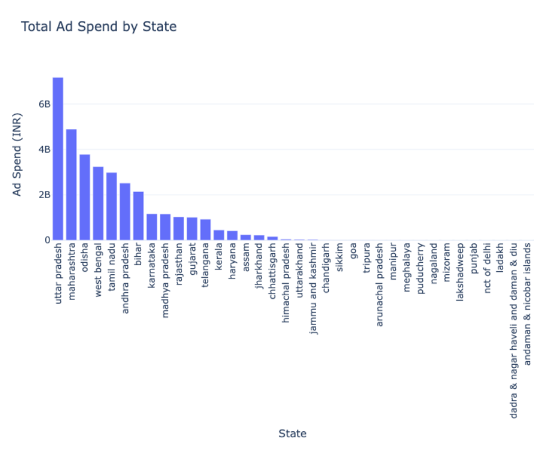
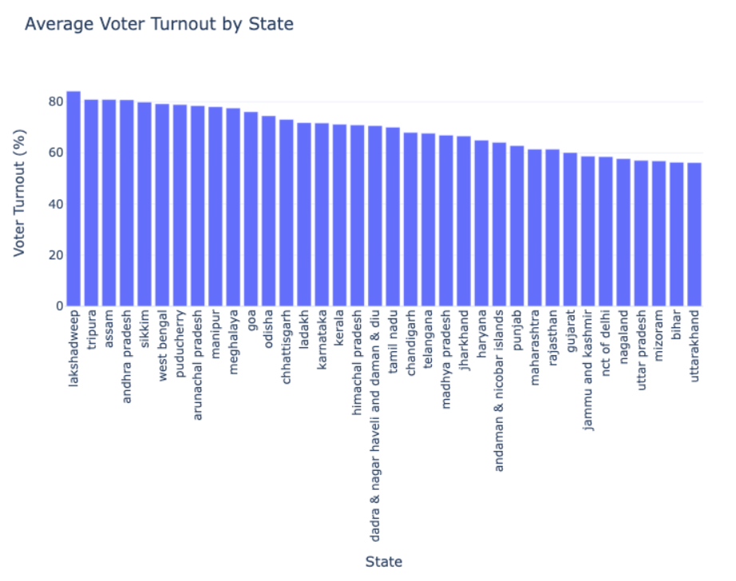
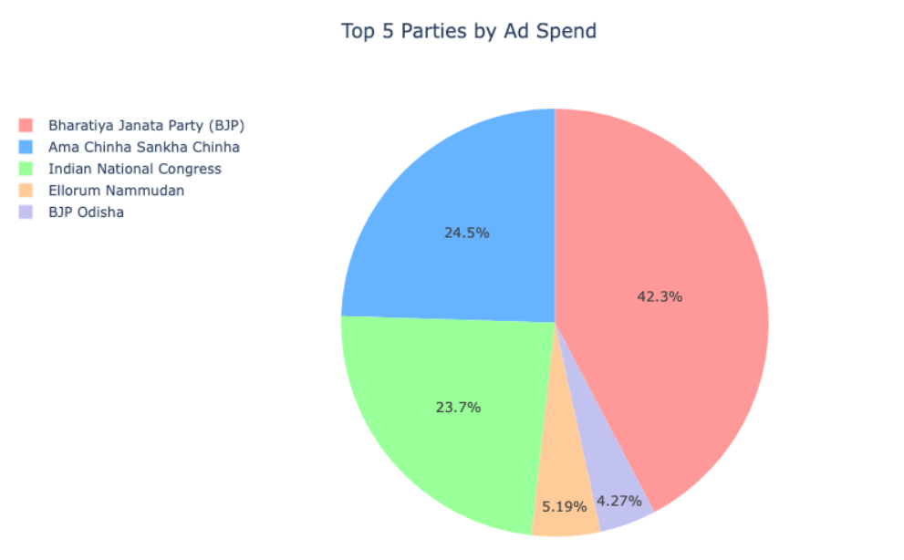
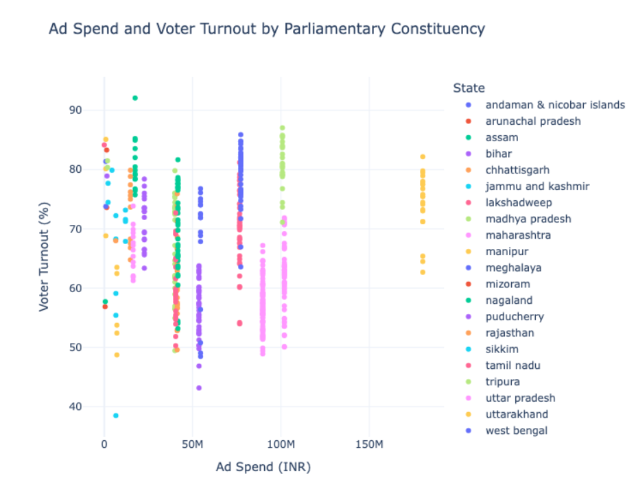
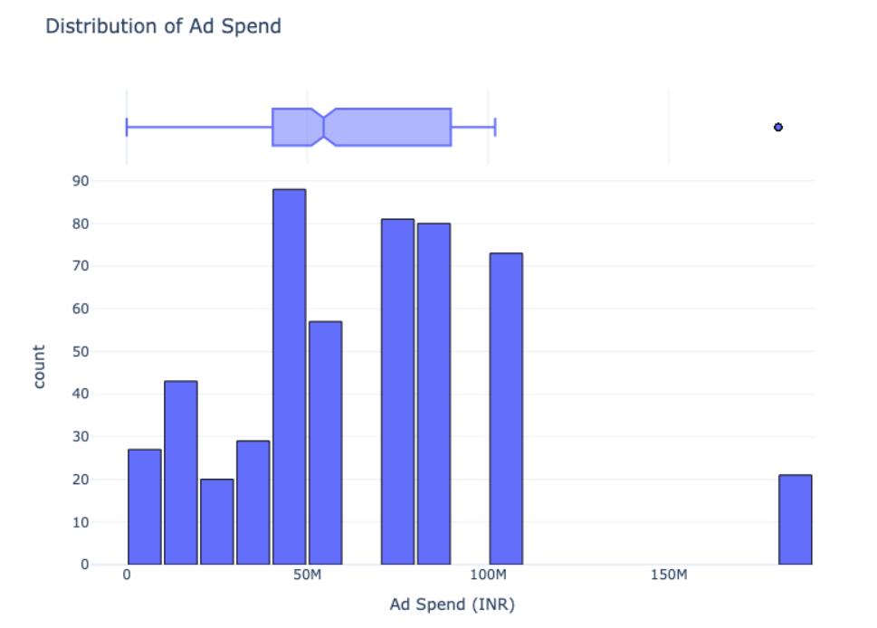
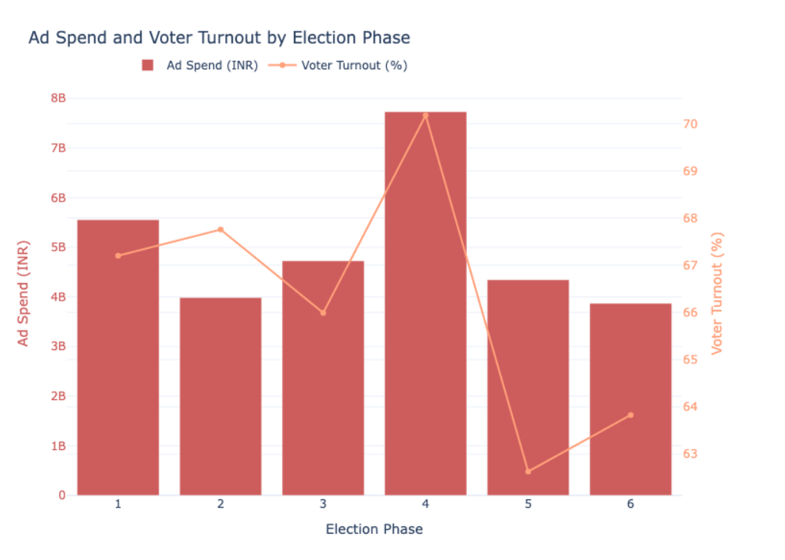

# Elections Ad Spending Analysis

## Project Overview

This project offers a detailed examination of election ad spending and its impact on voter turnout. By using a dataset that includes advertiser expenditures, location-specific ad investments, and actual voting outcomes, we aim to uncover any potential connections between ad spending and voter engagement across various states and constituencies.

## Dataset Overview

The dataset includes three primary files:

- **Advertisers Dataset**: Contains information on which parties or organizations are investing in election ads, along with the number of ads they have launched.
- **Locations Dataset**: Provides data on ad spending distribution across different areas, shedding light on the geographic focus of various campaigns.
- **Results Dataset**: Includes voting data, such as the number of votes cast in each location and the voter turnout percentage.

You can download the dataset from [here](#).

## Analysis Summary

### 1. **Total Ad Spend by State**

  
The analysis shows that Uttar Pradesh tops the list for the highest ad expenditure, followed by Maharashtra and Odisha. In contrast, smaller states like Lakshadweep and union territories like Dadra & Nagar Haveli have minimal ad spending. This suggests a correlation between ad expenditure and factors like political importance or population size.

### 2. **Average Voter Turnout by State**

  
Significant regional differences in voter turnout are observed. States like Lakshadweep, Tripura, and Assam exhibit high voter engagement, while regions with large ad spends, such as Uttar Pradesh and Bihar, have comparatively lower turnout. This indicates that ad spending alone does not necessarily drive voter participation.

### 3. **Top 5 Parties by Ad Spend**

  
The Bharatiya Janata Party (BJP) leads in ad spending, accounting for more than 40% of total expenditure. Other parties like Ama Chinha Sankha Chinha and the Indian National Congress also contribute significantly, but BJP’s ad investment far surpasses that of its competitors.

### 4. **Correlation Between Ad Spend and Voter Turnout**

A correlation analysis revealed a weak and slightly negative relationship between ad spend and voter turnout, with a correlation coefficient of -0.010688. This implies that higher ad spending does not necessarily result in increased voter engagement.

### 5. **Ad Spend and Voter Turnout by Parliamentary Constituency**

  
The scatter plot suggests that voter turnout typically falls between 60% and 80%, regardless of ad expenditure. This supports the conclusion that factors beyond ad spend likely influence voter behavior.

### 6. **Distribution of Ad Spending**

  
The distribution analysis reveals that most constituencies see ad expenditures between 50M and 100M INR, with a few notable outliers spending much more. The box plot highlights a median ad spend around 70M INR.

### 7. **Ad Spend and Voter Turnout by Election Phase**

  
No clear trend emerges between ad spend and voter turnout across different election phases. Interestingly, phases with higher ad spending do not always align with increased voter turnout.

## Conclusion

The findings suggest that higher ad spending does not necessarily lead to increased voter turnout. While larger states tend to invest more in advertising, this does not consistently translate into greater voter engagement. Political parties, especially the BJP, allocate substantial resources to advertising, but the effectiveness of this spending in boosting voter turnout appears to be limited.
